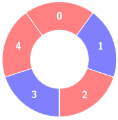
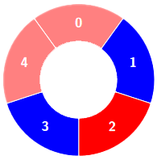
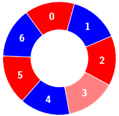

### 3208. Alternating Groups II

#### Problem Description

There is a circle of red and blue tiles. You are given an array of integers `colors` and an integer `k`. The color of tile `i` is represented by `colors[i]`:
- `colors[i] == 0` means that tile `i` is red.
- `colors[i] == 1` means that tile `i` is blue.

An alternating group is every `k` contiguous tiles in the circle with alternating colors (each tile in the group except the first and last one has a different color from its left and right tiles).

Return the number of alternating groups.

**Note** that since colors represents a circle, the first and the last tiles are considered to be next to each other.

***Example 1:*** 
**Input:**  colors = [0,1,0,1,0], k = 3
**Output:**  3
**Explanation:**

Alternating groups:

***Example 2:*** 
**Input:**  colors = [0,1,0,0,1,0,1], k = 6
**Output:**  2
**Explanation:**

Alternating groups:

***Example 3:*** 
**Input:**  colors = [1,1,0,1], k = 4
**Output:**  0
**Explanation:**

***Constraints:*** 
- `3 <= colors.length <= 105`
- `0 <= colors[i] <= 1`
- `3 <= k <= colors.length`